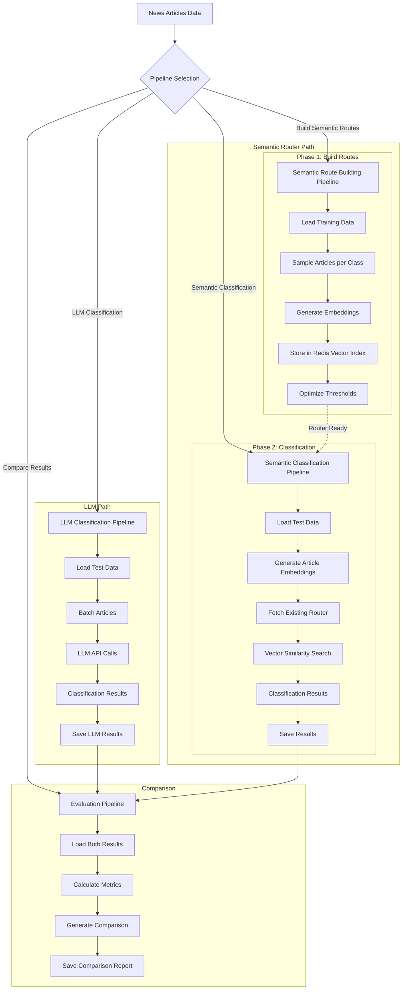

# News Classification: LLM vs Redis Semantic Router

**Compare LLM-based text classification with vector-based semantic routing for massive cost savings and speed improvements.**

This proof-of-concept demonstrates how Redis semantic routing can replace expensive LLM API calls for news classification, achieving **cost savings** and **speed improvements** with only a minor **accuracy trade-off**.

## Overview

This project implements two approaches for classifying BBC news articles into 5 categories (**business**, **entertainment**, **politics**, **sport**, **tech**):

1. **Baseline LLM**: Uses LiteLLM with Claude for direct text classification
2. **Redis Semantic Router**: Uses vector embeddings and Redis for fast similarity-based classification

Dataset: Pre-split BBC News articles:
- **Training**: 1,117 articles (`train_data.csv`) 
- **Validation**: 360 articles (`validation_data.csv`)
- **Test**: 735 articles (`BBC News Test.csv`)

## Prerequisites

- **Python 3.12+**
- **[uv](https://docs.astral.sh/uv/)** (Python package manager)
- **Docker** (for Redis)

## Installation

### 1. Clone and Install Dependencies
```bash
git clone <repository-url>
cd redis_semantic_router
uv sync
```

### 2. Start Redis Stack
```bash
# Start Redis with vector search extensions
docker run -d --name redis-stack -p 6379:6379 -p 8001:8001 redis/redis-stack:latest

# Verify Redis is running
docker ps | grep redis-stack
```

### 3. Setup Environment Variables
```bash
# Required for LLM classification
export ANTHROPIC_API_KEY="your_claude_api_key_here"

# Optional for OpenAI embeddings
export OPENAI_API_KEY="your_openai_api_key_here"
```

### 4. Verify Installation
```bash
# Test Redis connection
docker exec -it redis-stack redis-cli ping
# Expected: PONG

# Check system status
cd src
uv run python main.py status
# Expected: System status with Redis connection confirmed
```

## Usage

All commands run from the `src/` directory:

```bash
cd src
```

### Basic Commands

```bash
# Check system status
uv run python main.py status
# Expected: Shows Redis connection, datasets, and router status

# Build semantic routes (one-time setup)
uv run python main.py build_semantic_routes
# Expected: Creates vector embeddings for categories and stores routes in Redis

# Run baseline LLM classification
uv run python main.py llm_cls
# Expected: Processes validation articles with Claude API

# Run semantic classification
uv run python main.py semantic_cls
# Expected: Fast vector similarity search as an alternative for llm classification

# Compare results from both approaches
uv run python main.py evaluate
# Expected: Generates detailed comparison metrics and saves report

# Clear all routes from Redis
uv run python main.py clear-routes
# Expected: Removes all semantic routes from Redis
```

### Advanced Usage

```bash
# Use custom config file
uv run python main.py llm_cls --config custom_config.yaml

# Force rebuild semantic routes
uv run python main.py build_semantic_routes --force-retrain

# Run on training data instead of test/validation data
uv run python main.py llm_cls --train-articles
uv run python main.py semantic_cls --train-articles
```

## Embedding Vectorizers

**Note:** This is a Proof of Concept (POC). Due to time constraints, only a subset of RedisVL's vectorizer capabilities have been implemented.

### Implemented Vectorizers

This project implements support for two core embedding providers:

**HuggingFace Models (Free)**
- `sentence-transformers/all-MiniLM-L6-v2` (384 dimensions)
- No API costs, runs locally

**OpenAI Models (Paid)**  
- `text-embedding-3-small` (1536 dimensions) - $0.00002/1K tokens
- Requires OPENAI_API_KEY environment variable
- Automatic cost tracking included

### Additional RedisVL Vectorizers (Not Implemented)

RedisVL supports many other vectorizers that could be added in future versions:
- **Cohere**: `CohereTextVectorizer`
- **VertexAI**: `VertexAITextVectorizer` 
- **Azure OpenAI**: `AzureOpenAITextVectorizer`
- **Mistral**: `MistralAITextVectorizer`
- **Custom**: Build your own vectorizer implementation

## Architecture

### Design Philosophy

The codebase follows a **modular pipeline architecture** where each component can be executed independently or composed together. This design enables:

- **Independent execution**: Each classifier runs as a standalone pipeline
- **Composable workflows**: Pipelines can be chained for comparison analysis
- **Pluggable components**: Easy to swap classifiers or add new ones
- **Stateless operations**: Each pipeline is self-contained with its own configuration
- **Result persistence**: Each pipeline saves results independently for later analysis

### Pipeline Flow



### Classification Workflows

**LLM Classifier Flow:**
```
Articles → Batch → LLM Prompt → Async LiteLLM API → Classification
```

**Semantic Router Flow:**
```
Training: Articles → Sample → Embeddings → Redis Vector Index
Runtime:  Article → Embed → Vector Search → Classification
                           
```

### Project Structure
```
redis_semantic_router/
├── README.md                  # Project documentation
├── pyproject.toml             # Python project configuration
├── config/                    # Configuration files
│   └── pipeline_config.yaml   # Pipeline configuration
├── data/                      # Input datasets (gitignored)
│   └── bbc-news-articles-labeled/
├── results/                   # Generated results (gitignored)
│   ├── llm_classifier/        # LLM classification results
│   ├── semantic_router/       # Semantic router results
│   └── comparison/            # Evaluation results
└── src/                       # Source code
    ├── main.py                # CLI orchestrator
    ├── pipelines/             # Pipeline orchestration
    ├── llm_classifier/        # LLM classification components
    ├── semantic_router/       # Vector-based classification
    ├── shared/                # Common utilities and abstractions
    └── utils/                 # Configuration, data loading, logging
```

## Embedding Vectorizers

**Note:** This is a Proof of Concept (POC). Due to time constraints, only a subset of RedisVL's vectorizer capabilities have been implemented.

### Implemented Vectorizers

This project implements support for two core embedding providers:

**HuggingFace Models (Free)**
- `sentence-transformers/all-MiniLM-L6-v2` (384 dimensions)
- No API costs, runs locally

**OpenAI Models (Paid)**  
- `text-embedding-3-small` (1536 dimensions) - $0.00002/1K tokens
- Requires OPENAI_API_KEY environment variable
- Automatic cost tracking included

### Additional RedisVL Vectorizers (Not Implemented)

RedisVL supports many other vectorizers that could be added in future versions:
- **Cohere**: `CohereTextVectorizer`
- **VertexAI**: `VertexAITextVectorizer` 
- **Azure OpenAI**: `AzureOpenAITextVectorizer`
- **Mistral**: `MistralAITextVectorizer`
- **Custom**: Build your own vectorizer implementation

## Configuration

### Basic Configuration

The main configuration file is `config/pipeline_config.yaml`. Key settings:

```yaml
# Choose embedding provider (HuggingFace or OpenAI)
semantic_router:
  vectorizer:
    type: "huggingface"  # Options: "huggingface" or "openai"
    model: "sentence-transformers/all-MiniLM-L6-v2"
    track_usage: true
```

### Embedding Provider Options

**HuggingFace (Default - Free)**
```yaml
semantic_router:
  vectorizer:
    type: "huggingface"
    model: "sentence-transformers/all-MiniLM-L6-v2"
```

**OpenAI (Paid - Better Performance)**
```yaml
semantic_router:
  vectorizer:
    type: "openai"
    model: "text-embedding-3-small"
    api_key_env: "OPENAI_API_KEY"
    track_usage: true
```

After changing vectorizer type, retrain the router:
```bash
python main.py build_semantic_routes --force-retrain
```

> **Note:** Training always creates a fresh router with `overwrite=True`, replacing any existing router with the same name. The system automatically handles creating new routers vs loading existing ones during classification.

### Advanced Configuration

> **Note:** Classification categories are defined in the `NewsCategory` enum in `shared/data_types.py`. To add new categories, update this enum rather than configuration files.

<details>
<summary>Full configuration options</summary>

```yaml
# Dataset settings  
data:
  dataset_path: "data/bbc-news-articles-labeled"
  train_file: "train_data.csv"
  validation_file: "validation_data.csv"

# LLM Classifier settings
llm_classifier:
  model_name: "claude-sonnet-4-20250514"
  batch_size: 10
  max_concurrent: 20
  temperature: 0
  max_tokens: 50000
  save_results: true
  results_dir: "results/llm_classifier"

# Redis semantic router settings
semantic_router:
  vectorizer:
    type: "huggingface"  # Options: "huggingface" or "openai"
    model: "sentence-transformers/all-MiniLM-L6-v2"
    track_usage: true
  
  router_name: "news-classification-router"
  route_config:
    samples_per_class: 100
    initial_threshold: 0.6
    max_text_length: 8000  # Legacy parameter - will be removed
    optimize_thresholds: true
  save_results: true
  results_dir: "results/semantic_router"
```
</details>

## Performance Analysis at Scale
## Performance Analysis at Scale

Based on actual test results with 360 validation articles, here's the projected performance at **100,000 articles**:

### Claude Sonnet
- **Total cost**: $186 (at $0.00186 per article)
- **Total processing time**: 6-7 hours (0.23 seconds per article)
- **Accuracy**: 95.5%
- **F1 macro**: 95.6%

### Claude Haiku
- **Total cost**: $55 (at $0.00055 per article)
- **Total processing time**: 13-14 hours (0.49 seconds per article)
- **Accuracy**: 73.6%
- **F1 macro**: 75.7%

### Semantic Router (HuggingFace embeddings)
- **Total cost**: $0 (no API costs after training)
- **Total processing time**: 21 minutes (0.02 seconds per article)
- **Accuracy**: 92.7%
- **F1 macro**: 92.7%

### Performance Comparison

**Semantic Router vs Claude Haiku:**
- **Cost savings**: 100% ($55 → $0)
- **Speed improvement**: 38.6x faster (13.5 hours → 21 minutes)
- **Accuracy improvement**: +19.1 percentage points (73.6% → 92.7%)
- **F1 macro improvement**: +17.0 percentage points (75.7% → 92.7%)

**Semantic Router vs Claude Sonnet:**
- **Cost savings**: 100% ($186 → $0) 
- **Speed improvement**: 19.3x faster (6.5 hours → 21 minutes)
- **Accuracy trade-off**: -2.8 percentage points (95.5% → 92.7%)
- **F1 macro trade-off**: -2.9 percentage points (95.6% → 92.7%)

### Key Insight

The semantic router offers a **sweet spot** between cost, speed, and accuracy:
- **Significantly outperforms** Claude Haiku on all metrics while being free and 38x faster
- **Closely matches** Claude Sonnet's accuracy (92.7% vs 95.5%) while being free and 19x faster
- **Ideal for high-volume scenarios** where the minor accuracy trade-off vs premium LLMs is acceptable

The semantic router provides massive operational benefits for production workloads, making it particularly valuable for real-time classification at scale.

## Results

### Output Structure
```
results/
├── llm_classifier/            # LLM classification results
├── semantic_router/           # Semantic router results  
└── comparison/                # Side-by-side comparison
    └── 2025-08-30_22-15-04_7ff67441/
        ├── metrics.json       # Performance metrics
        ├── classifications.csv # Article-level predictions
        └── run_info.json      # Run metadata
```

### Viewing Results
```bash
# Check latest results
python main.py status

# Redis web interface
open http://localhost:8001
```

## Troubleshooting

```bash
# Redis not running
docker restart redis-stack

# Clear Redis data
python main.py clear-routes

# Import errors - ensure you're in src/
cd src

# Memory issues - reduce sample sizes in config
```

This implementation provides a complete comparison framework for evaluating LLM vs semantic routing approaches to news classification.